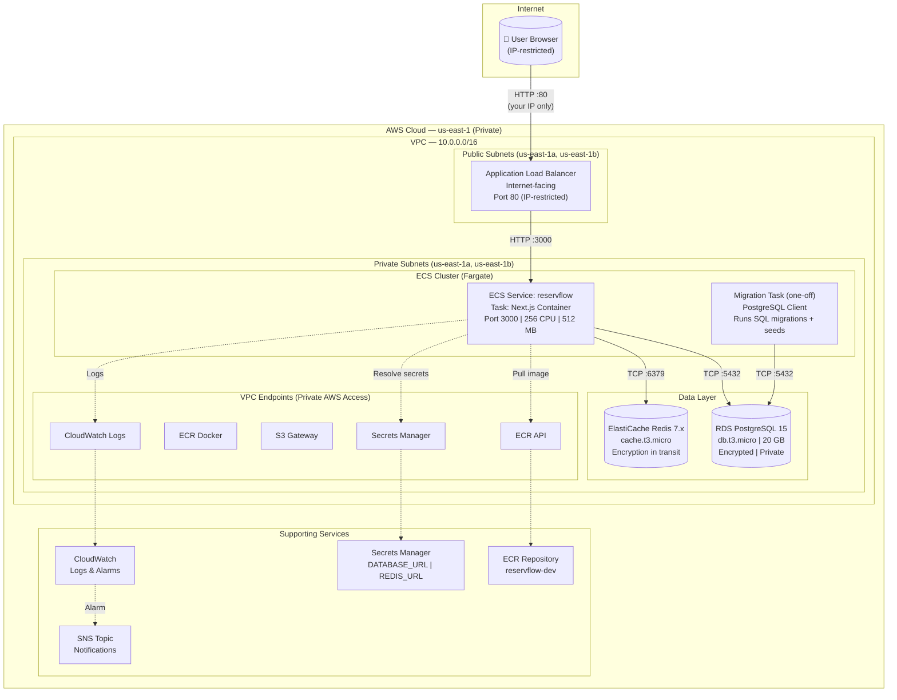
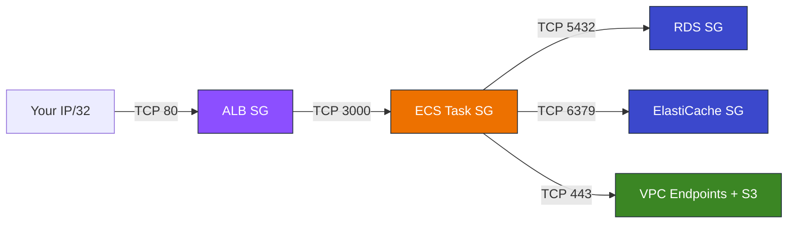
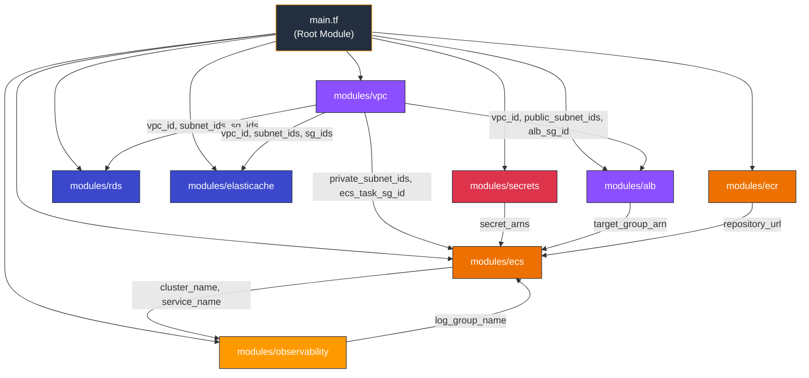
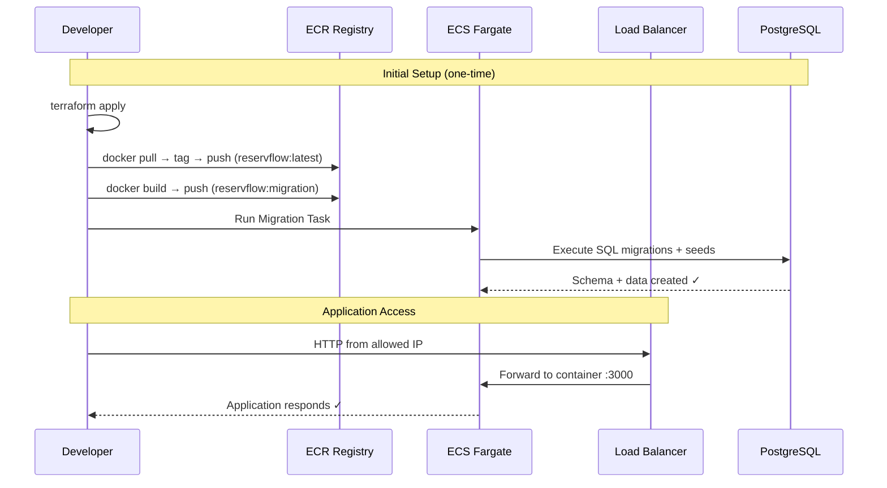

# ReservFlow — Hotel Reservation System

## Overview

ReservFlow is a hotel reservation system built as a monolithic Next.js 14 application, deployed on AWS using ECS Fargate with PostgreSQL (RDS) and Redis (ElastiCache). All infrastructure is fully private (no resources exposed to 0.0.0.0/0) and managed via Terraform.

**Docker Image:** `nino200431/reservflow:latest`  
**ALB Endpoint:** `http://reservflow-dev-alb-856383033.us-east-1.elb.amazonaws.com` (restricted to allowed IPs)

---

## Tech Stack

| Layer | Technology |
|-------|-----------|
| Framework | Next.js 14 (TypeScript, standalone output) |
| Runtime | Node.js 20 Alpine |
| Database | PostgreSQL 15 (AWS RDS) |
| Cache | Redis 7.x (AWS ElastiCache) |
| Compute | AWS ECS Fargate |
| Load Balancer | AWS ALB (IP-restricted) |
| Container Registry | AWS ECR |
| Secrets | AWS Secrets Manager |
| Observability | AWS CloudWatch + SNS |
| Networking | VPC Endpoints (no NAT, no internet) |
| IaC | Terraform |
| Validation | Zod |
| Testing | Vitest + fast-check (property-based) |
| Styling | Tailwind CSS |

---

## System Architecture



---

## Security Architecture

### No Internet Exposure

- **No NAT Gateway** — private subnets have no route to internet
- **No 0.0.0.0/0** in any security group (ingress or egress)
- **ALB restricted** to specific IP CIDRs (configured in `allowed_cidr_blocks`)
- **VPC Endpoints** replace internet access for AWS services (ECR, S3, Secrets Manager, CloudWatch Logs)

### Security Group Rules



### SCP Compliance

| Restriction | Status |
|---|---|
| No resources exposed to 0.0.0.0/0 | ✅ |
| Tags: Team="team-7", Name="daniel.guzman@iteso.mx", Owner="daniel.guzman@iteso.mx" | ✅ |
| Region: us-east-1 only | ✅ |
| RDS: db.t3.micro (allowed family) | ✅ |
| No SSH/RDP open | ✅ |
| No S3 via Terraform | ✅ |
| No IAM users with console access | ✅ |

---

## Terraform Module Structure



### Directory Layout

```
terraform/
├── main.tf              # Root module — orchestrates all modules
├── variables.tf         # Input variables with defaults for dev
├── outputs.tf           # ALB DNS, ECR URL, RDS endpoint
├── environments/
│   ├── dev.tfvars       # Dev environment overrides
│   └── prod.tfvars      # Production environment overrides
└── modules/
    ├── vpc/             # VPC, subnets, VPC Endpoints, security groups
    ├── ecs/             # ECS cluster, service, task definitions, IAM
    ├── rds/             # PostgreSQL instance, subnet group
    ├── elasticache/     # Redis replication group, subnet group
    ├── alb/             # Load balancer, target group, listeners
    ├── ecr/             # Container registry, lifecycle policy
    ├── secrets/         # Secrets Manager (DB URL, Redis URL, RDS password)
    └── observability/   # CloudWatch log group, alarms, SNS
```

---

## Deployment Flow



---

## Quick Start

```bash
# 1. Initialize and deploy infrastructure
cd terraform
terraform init
terraform plan -var-file="environments/dev.tfvars" -var="db_password=YOUR_PASSWORD"
terraform apply -var-file="environments/dev.tfvars" -var="db_password=YOUR_PASSWORD"

# 2. Push app image to ECR
aws ecr get-login-password --region us-east-1 | docker login --username AWS --password-stdin 311141527383.dkr.ecr.us-east-1.amazonaws.com
docker pull nino200431/reservflow:latest
docker tag nino200431/reservflow:latest 311141527383.dkr.ecr.us-east-1.amazonaws.com/reservflow-dev:latest
docker push 311141527383.dkr.ecr.us-east-1.amazonaws.com/reservflow-dev:latest

# 3. Build and push migration image
cd ../database
docker build --platform linux/amd64 --provenance=false -t 311141527383.dkr.ecr.us-east-1.amazonaws.com/reservflow-dev:migration .
docker push 311141527383.dkr.ecr.us-east-1.amazonaws.com/reservflow-dev:migration

# 4. Run database migrations
cd ../terraform
aws ecs run-task --cluster reservflow-dev --task-definition reservflow-dev-migration --launch-type FARGATE --network-configuration "awsvpcConfiguration={subnets=[SUBNET_ID],securityGroups=[SG_ID],assignPublicIp=DISABLED}" --region us-east-1

# 5. Access the application (from allowed IP only)
# http://reservflow-dev-alb-856383033.us-east-1.elb.amazonaws.com
```

---

## Application Components

### API Endpoints

| Method | Path | Description |
|--------|------|-------------|
| POST | `/api/reservations` | Create a reservation |
| GET | `/api/reservations` | List reservations (filterable) |
| GET | `/api/reservations/:id` | Get reservation by ID |
| PATCH | `/api/reservations/:id` | Update reservation status |
| DELETE | `/api/reservations/:id` | Cancel reservation |
| GET | `/api/rooms/availability` | Check room availability |
| GET | `/api/admin/dashboard` | Admin dashboard data |

### Database Schema

| Table | Purpose |
|-------|---------|
| `rooms` | Room catalog (type, capacity, price, active status) |
| `guests` | Guest records (name, email unique, phone) |
| `reservations` | Booking lifecycle with status enum (Pendiente → Confirmada → Completada/Cancelada) |
| `room_inventory` | Availability by room type and date (source of truth) |

---

## Environment Variables

| Variable | Description | Source |
|----------|-------------|--------|
| `DATABASE_URL` | PostgreSQL connection string (with sslmode=no-verify) | Secrets Manager |
| `REDIS_URL` | Redis connection URL (rediss:// for TLS) | Secrets Manager |
| `NODE_ENV` | Runtime environment | Task definition (plaintext) |

---

## AWS Account Info

- **Account:** 311141527383
- **Region:** us-east-1
- **Team:** team-7
- **Contact:** daniel.guzman@iteso.mx
- **Docker Hub:** nino200431
- **SSO Portal:** https://joalgama.awsapps.com/start/#/

---

## Project Documentation

| Document | Location |
|----------|----------|
| OpenAPI Spec | `openapi.yaml` |
| Architecture Context | `docs/reservflow-project-context.md` |
| Mermaid Diagrams | `docs/ecs-fargate-architecture.md` |
| Functional & Non-Functional Requirements | `documentation/FR & NFR.MD` |
| ADR Records | `documentation/ADR_Records.MD` |
| C4 Model Diagrams | `documentation/C4_Model_Diagrams.MD` |
| Test Plan | `documentation/Test_Plan.MD` |
