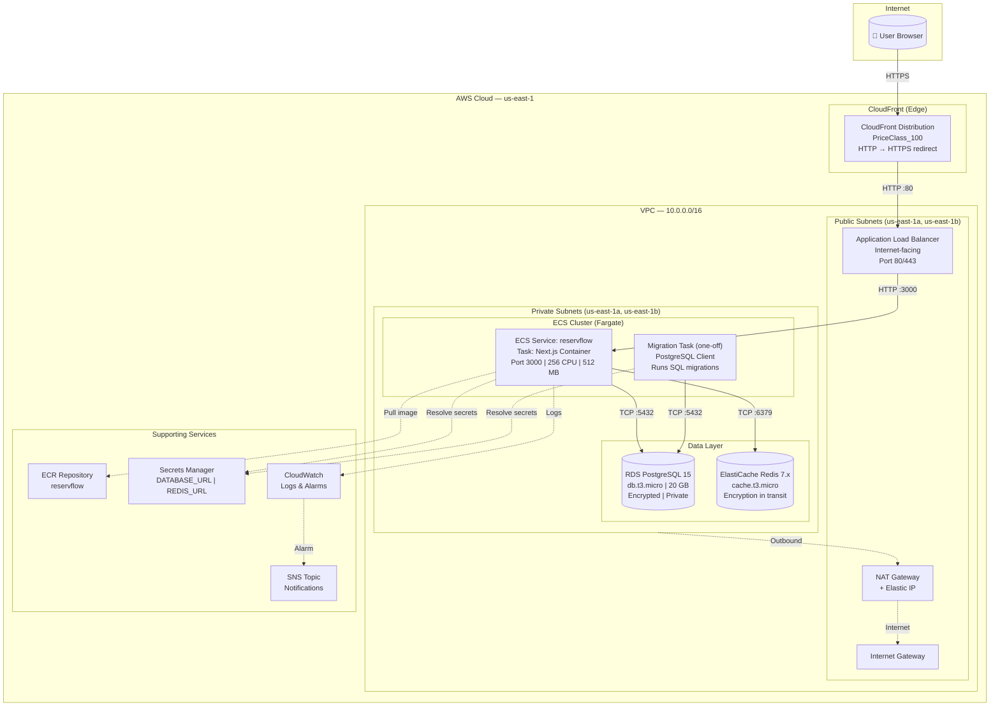
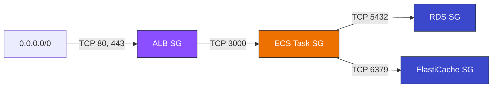
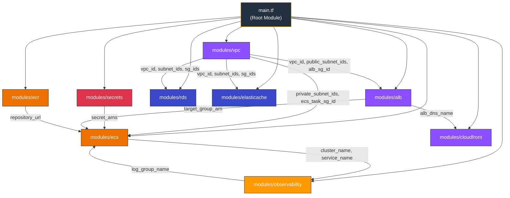
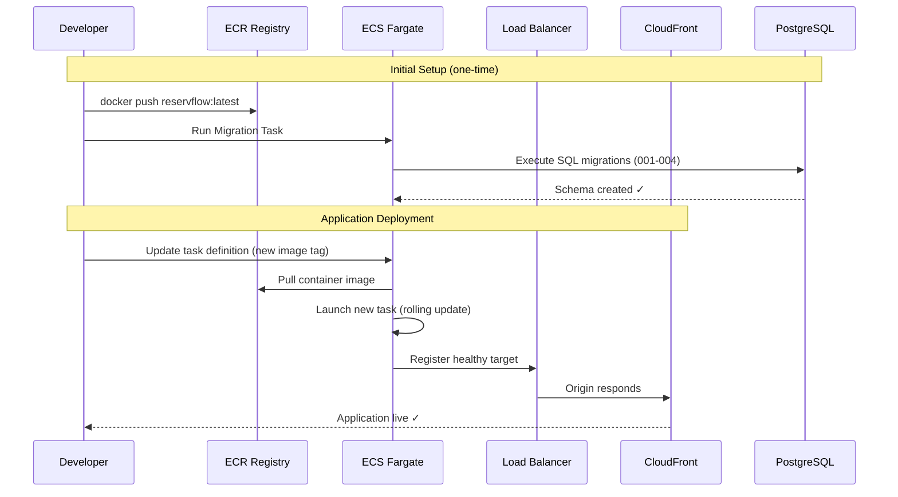

# ReservFlow — Hotel Reservation System

## Overview

ReservFlow is a hotel reservation system built as a monolithic Next.js 14 application, deployed on AWS using ECS Fargate with PostgreSQL (RDS) and Redis (ElastiCache). Infrastructure is fully managed via Terraform.

**Docker Image:** `nino200431/reservflow:latest`

---

## Tech Stack

| Layer | Technology |
|-------|-----------|
| Framework | Next.js 14 (TypeScript, standalone output) |
| Runtime | Node.js 20 Alpine |
| Database | PostgreSQL 15 (AWS RDS) |
| Cache | Redis 7.x (AWS ElastiCache) |
| Compute | AWS ECS Fargate |
| CDN | AWS CloudFront |
| Load Balancer | AWS ALB |
| Container Registry | AWS ECR |
| Secrets | AWS Secrets Manager |
| Observability | AWS CloudWatch + SNS |
| IaC | Terraform |
| Validation | Zod |
| Testing | Vitest + fast-check (property-based) |
| Styling | Tailwind CSS |

---

## System Architecture



---

## Security Group Rules



---

## Terraform Module Structure



### Directory Layout

```
terraform/
├── main.tf              # Root module — orchestrates all modules
├── variables.tf         # Input variables with defaults for dev
├── outputs.tf           # ALB DNS, CloudFront domain, ECR URL, RDS endpoint
├── environments/
│   ├── dev.tfvars       # Dev environment overrides
│   └── prod.tfvars      # Production environment overrides
└── modules/
    ├── vpc/             # VPC, subnets, NAT, security groups
    ├── ecs/             # ECS cluster, service, task definitions, IAM
    ├── rds/             # PostgreSQL instance, subnet group
    ├── elasticache/     # Redis replication group, subnet group
    ├── alb/             # Load balancer, target group, listeners
    ├── ecr/             # Container registry, lifecycle policy
    ├── cloudfront/      # CDN distribution
    ├── secrets/         # Secrets Manager (DB URL, Redis URL, RDS password)
    └── observability/   # CloudWatch log group, alarms, SNS
```

---

## Deployment Flow



---

## Application Components

### API Endpoints

| Method | Path | Description |
|--------|------|-------------|
| POST | `/api/reservations` | Create a reservation |
| GET | `/api/reservations` | List reservations (filterable) |
| GET | `/api/reservations/:id` | Get reservation by ID |
| PATCH | `/api/reservations/:id` | Update reservation status |
| DELETE | `/api/reservations/:id` | Cancel reservation |
| GET | `/api/rooms/availability` | Check room availability |
| GET | `/api/admin/dashboard` | Admin dashboard data |

### Core Modules

| Module | Responsibility |
|--------|---------------|
| `src/modules/reservations/` | Reservation lifecycle (create, modify, cancel, status transitions) |
| `src/modules/inventory/` | Room availability with Redis cache-first strategy |
| `src/modules/integrations/` | External platform adapters (extensible) |
| `src/components/` | React UI — search, booking funnel, admin dashboard |

### Database Schema

| Table | Purpose |
|-------|---------|
| `rooms` | Room catalog (type, capacity, price, active status) |
| `guests` | Guest records (name, email unique, phone) |
| `reservations` | Booking lifecycle with status enum (Pendiente → Confirmada → Completada/Cancelada) |
| `room_inventory` | Availability by room type and date (source of truth) |

---

## Environment Variables

| Variable | Description | Source |
|----------|-------------|--------|
| `DATABASE_URL` | PostgreSQL connection string | Secrets Manager |
| `REDIS_URL` | Redis connection URL | Secrets Manager |
| `NODE_ENV` | Runtime environment | Task definition (plaintext) |

---

## AWS Account Constraints (SCP)

- **Region:** us-east-1 only
- **Tags (mandatory):** `Team = "team-7"`, `Name = "daniel.guzman@iteso.mx"`
- **RDS:** db.t2, db.t3, db.t4g families only
- **No open ports:** SSH/RDP to 0.0.0.0/0 blocked
- **No S3 via Terraform:** Buckets must be created via Console
- **Terraform provider:** Uses `default_tags` for automatic tag propagation

---

## Quick Start

```bash
# Initialize Terraform
cd terraform
terraform init

# Plan for dev environment
terraform plan -var-file=environments/dev.tfvars

# Apply infrastructure
terraform apply -var-file=environments/dev.tfvars

# Push Docker image to ECR
aws ecr get-login-password --region us-east-1 | docker login --username AWS --password-stdin <ecr-url>
docker tag nino200431/reservflow:latest <ecr-url>/reservflow:latest
docker push <ecr-url>/reservflow:latest

# Run database migrations (one-off ECS task)
aws ecs run-task \
  --cluster reservflow \
  --task-definition reservflow-migration \
  --launch-type FARGATE \
  --network-configuration "awsvpcConfiguration={subnets=[<private-subnet>],securityGroups=[<ecs-sg>]}"
```

---

## Project Documentation

| Document | Location |
|----------|----------|
| OpenAPI Spec | `openapi.yaml` |
| Architecture Context | `docs/reservflow-project-context.md` |
| Mermaid Diagrams | `docs/ecs-fargate-architecture.md` |
| Functional & Non-Functional Requirements | `documentation/FR & NFR.MD` |
| ADR Records | `documentation/ADR_Records.MD` |
| C4 Model Diagrams | `documentation/C4_Model_Diagrams.MD` |
| Test Plan | `documentation/Test_Plan.MD` |
| Quality Reports | `documentation/Quality_Final_Report.MD` |

---

## Team

- **Team:** team-7
- **Contact:** daniel.guzman@iteso.mx
- **AWS Account:** 311141527383
- **Docker Hub:** nino200431
