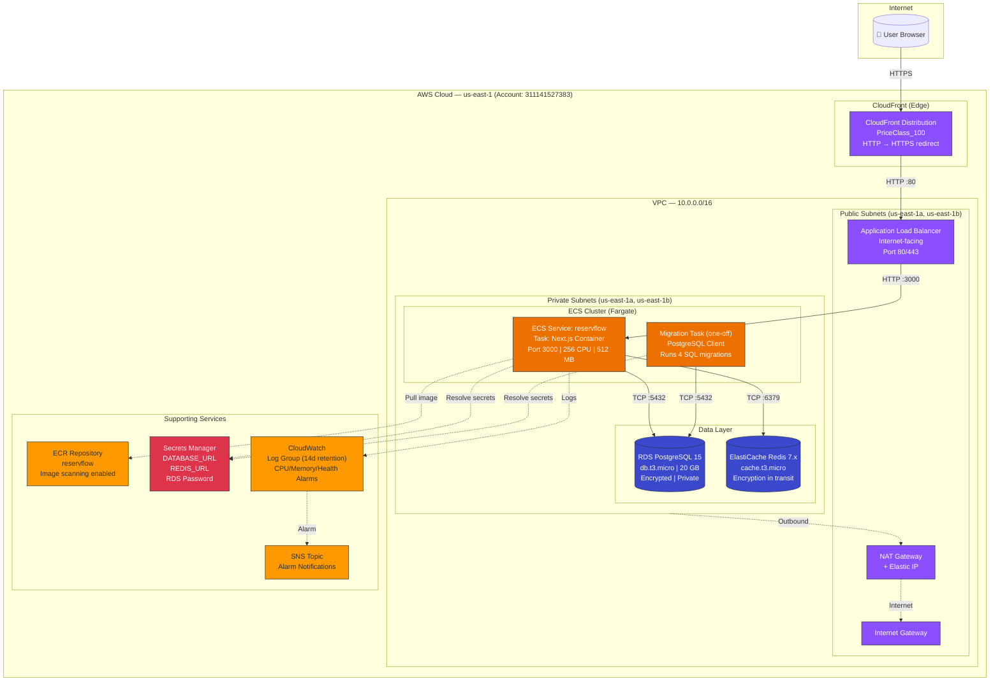
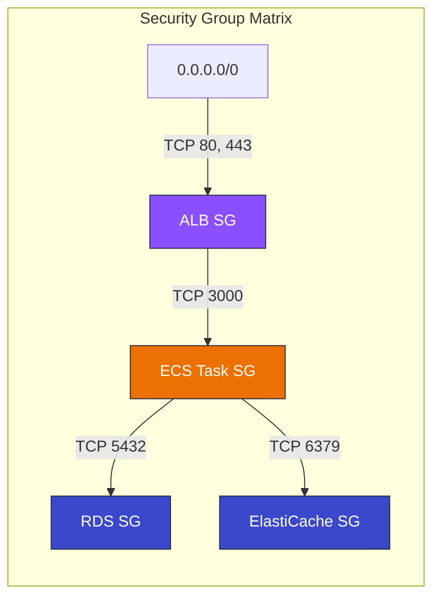
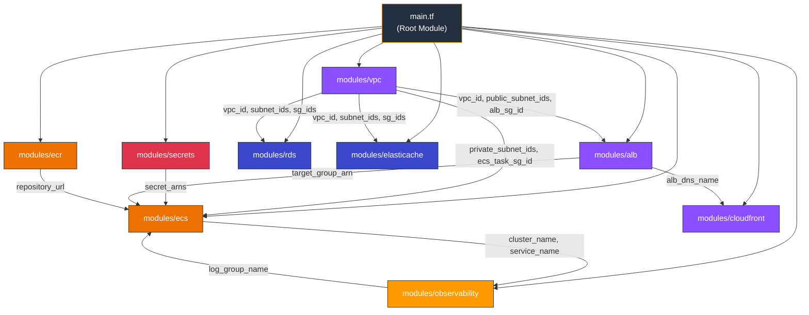
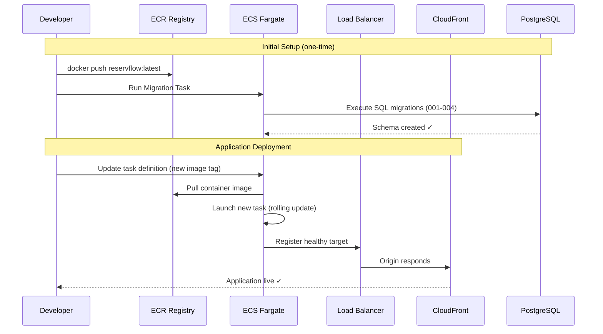

# ReservFlow — ECS Fargate Infrastructure Architecture

## System Architecture

## Security Group Rules

## Terraform Module Dependencies

## Deployment Flow

## Tags (SCP Compliance)

All resources are tagged with:
- `Team = "team-7"`
- `Name = "daniel.guzman@iteso.mx"`

Applied via Terraform `default_tags` provider block + explicit tags where required at creation time.
