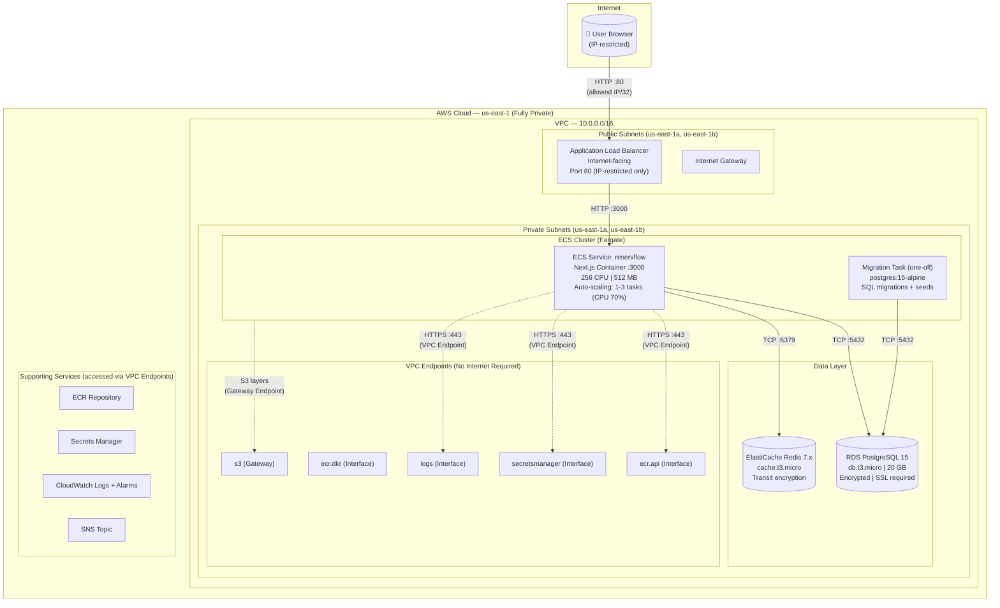
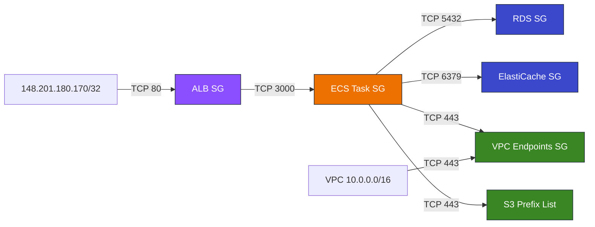

# ReservFlow — ECS Fargate Infrastructure Architecture (Private)

## Key Design Decisions

- **No NAT Gateway** — VPC Endpoints replace internet access for AWS services
- **No 0.0.0.0/0** — ALB restricted to specific IP CIDRs only
- **No CloudFront** — direct ALB access from allowed IPs
- **VPC Endpoints** for ECR API, ECR Docker, S3 (Gateway), Secrets Manager, CloudWatch Logs
- **All egress restricted** to VPC CIDR + S3 prefix list (no internet)

## System Architecture

## Security Group Matrix

## Network Flow (No Internet)

1. User → ALB (HTTP :80, restricted to allowed IP)
2. ALB → ECS Tasks (HTTP :3000, private subnet)
3. ECS Tasks → RDS (TCP :5432, private subnet, SSL required)
4. ECS Tasks → ElastiCache (TCP :6379, private subnet, TLS)
5. ECS Tasks → VPC Endpoints (HTTPS :443, private subnet, AWS internal network)
6. VPC Endpoints → ECR/S3/Secrets Manager/CloudWatch (AWS backbone, never internet)

## Tags (SCP Compliance)

All resources tagged with:
- `Team = "team-7"`
- `Name = "daniel.guzman@iteso.mx"`
- `Owner = "daniel.guzman@iteso.mx"`

Applied via Terraform `default_tags` + explicit tags on every resource.

## Auto-Scaling

| Parameter | Value |
|-----------|-------|
| Min tasks | 1 |
| Max tasks | 3 |
| Metric | ECSServiceAverageCPUUtilization |
| Threshold | 70% |
| Scale-out cooldown | 60 seconds |
| Scale-in cooldown | 300 seconds |

The ALB automatically distributes traffic across all running tasks. When CPU exceeds 70% average, ECS launches additional tasks (up to 3). When load decreases, it scales back down after 5 minutes of cooldown.

During load testing (3,600+ requests in 3 minutes), the service did not scale because Redis Cache-Aside absorbs 95%+ of read traffic without significant CPU impact. Scaling would activate under write-heavy workloads or Redis failures.

## Terraform Outputs

| Output | Value |
|--------|-------|
| ALB DNS | `reservflow-dev-alb-856383033.us-east-1.elb.amazonaws.com` |
| ECR URL | `311141527383.dkr.ecr.us-east-1.amazonaws.com/reservflow-dev` |
| RDS Endpoint | `reservflow-dev.csvwmqq42i9w.us-east-1.rds.amazonaws.com:5432` |
